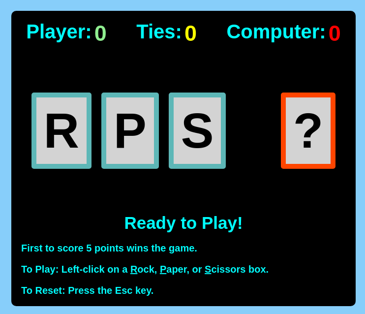

# Rock, Paper, Scissors Game

## Introduction

This [Rock, Paper, Scissors Game](https://mike-c2.github.io/odin-rps) was made as a project for [The Odin Project](https://www.theodinproject.com). More specifically, these two projects:

- [Project: Rock Paper Scissors](https://www.theodinproject.com/lessons/foundations-rock-paper-scissors)
- [Revisiting Rock Paper Scissors](https://www.theodinproject.com/lessons/foundations-revisiting-rock-paper-scissors)

This project was mading using HTML, CSS, and JavaScript.

## How to Play

To play a round, choose a selection by clicking on either the 'R', 'P', or 'S' boxes with the light blue border.  The result of each round will be displayed and the score will be updated accordingly.

The game ends once either the Player or the Computer scores 5 points.